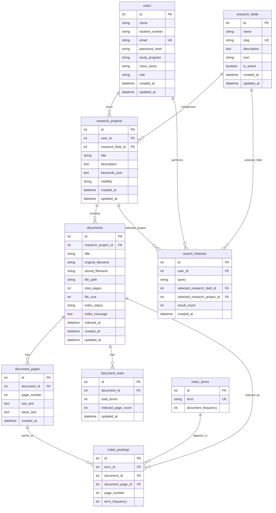

# Litera Implementation Plan

## 1. Ringkasan Audit

Litera saat ini adalah prototype frontend hasil export Figma Make. Desain visual, layout, komponen, dan mock data sudah tersedia cukup lengkap untuk menggambarkan pengalaman pengguna MVP, tetapi seluruh fitur bisnis masih simulasi di sisi client.

Temuan utama:

- Repository hanya berisi frontend Vite/React dan dokumen produk (`PRD.md`, `AGENTS.md`).
- Belum ada backend, database, REST API, authentication nyata, upload PDF nyata, PDF extraction, indexing, atau search engine.
- Routing masih state-based melalui `AppContext` dan `Page`, bukan URL routing.
- Semua data domain berasal dari `src/app/components/data.ts`.
- Login, register, create collection, upload, search, admin CRUD, dan re-index masih memakai local state, `setTimeout`, dan toast.
- Build/dev awal gagal karena dependency belum terpasang dan belum ada lockfile.
- Sebelum baseline tooling dirapikan, belum ada script lint, typecheck, atau test.

Scope audit ini tidak mengubah desain visual dan tidak mengimplementasikan backend atau fitur bisnis.

## 2. Stack Teknologi Frontend Aktual

Stack yang ditemukan dari `package.json`, `vite.config.ts`, dan source code:

- Runtime/build: Vite 6.
- UI framework: React 18 + TypeScript TSX.
- Styling: Tailwind CSS 4 melalui `@tailwindcss/vite`, custom CSS variables di `src/styles/theme.css`.
- UI primitives: Radix UI dan komponen shadcn-style di `src/app/components/ui`.
- Icon: `lucide-react`.
- Toast: `sonner`.
- Chart-ready dependency: `recharts`, walau belum dipakai di halaman utama.
- Routing dependency: `react-router` ada, tetapi belum dipakai.
- Additional dependencies hasil Figma Make: MUI, Emotion, Motion, React DnD, carousel, drawer, tabs, select, dan primitives lain.

Package manager yang dipakai untuk tahap berikutnya: npm. File `pnpm-workspace.yaml` berasal dari export, tetapi workflow proyek memakai `npm install` dan `package-lock.json`.

## 3. Struktur Folder Aktual

```text
.
|-- AGENTS.md
|-- ATTRIBUTIONS.md
|-- PRD.md
|-- README.md
|-- default_shadcn_theme.css
|-- index.html
|-- package.json
|-- pnpm-workspace.yaml
|-- postcss.config.mjs
|-- vite.config.ts
|-- src/
    |-- main.tsx
    |-- app/
    |   |-- App.tsx
    |   |-- context.tsx
    |   |-- components/
    |       |-- AdminDashboard.tsx
    |       |-- CollectionDetailPage.tsx
    |       |-- CreateCollectionPage.tsx
    |       |-- HomePage.tsx
    |       |-- LoginPage.tsx
    |       |-- Navbar.tsx
    |       |-- ResearchFieldsPage.tsx
    |       |-- SearchResultsPage.tsx
    |       |-- StudentDashboard.tsx
    |       |-- UploadModal.tsx
    |       |-- data.ts
    |       |-- ui.tsx
    |       |-- figma/
    |       |-- ui/
    |-- imports/
    |-- styles/
```

Folder yang ditambahkan pada tahap baseline:

```text
docs/
src/test/
```

## 4. Halaman dan Reusable Components Tersedia

Halaman utama:

- `LoginPage`: login dan register dalam satu komponen, masih simulasi.
- `HomePage`: beranda, hero, search bar, filter bidang, statistik, bidang populer, koleksi terbaru.
- `SearchResultsPage`: hasil pencarian mock, filter bidang, sorting relevansi/tanggal, kartu hasil, halaman relevan mock.
- `ResearchFieldsPage`: daftar bidang dan detail bidang.
- `CollectionDetailPage`: detail koleksi, daftar PDF, status indexing, filter status, quick search.
- `StudentDashboard`: ringkasan mahasiswa, koleksi, PDF, indexing, riwayat, profil.
- `CreateCollectionPage`: form pembuatan koleksi mock.
- `AdminDashboard`: ringkasan admin, bidang penelitian, pengguna, koleksi, dokumen, monitoring indexing, settings.
- `UploadModal`: multiple PDF upload UI dengan simulasi progress dan indexing.
- `Navbar`: navigasi global, search, avatar menu, upload button.

Reusable components yang aman dipertahankan:

- `Button`, `Badge`, `Card`, `InputField`, `TextareaField`, `Avatar`, `Separator`, `Chip`, `StatusDot`, `ProgressBar` dari `src/app/components/ui.tsx`.
- Komponen Radix/shadcn-style di `src/app/components/ui/*`, misalnya dialog, sheet, select, tabs, table, tooltip, sidebar, card, input, textarea.
- Data mock di `src/app/components/data.ts` perlu dipertahankan sampai API integration siap, agar desain tetap hidup selama transisi.

## 5. Gap Analysis terhadap PRD

| Area PRD | Status Saat Ini | Gap |
|---|---|---|
| Register dan login | UI tersedia, simulasi | Belum ada backend auth, JWT, password hash, session persistence |
| Role admin/mahasiswa | UI admin dan mahasiswa tersedia | Role masih hardcoded; belum ada permission guard |
| CRUD bidang penelitian | UI admin tersedia | Belum persisten, belum validasi slug/status aktif |
| CRUD koleksi penelitian | UI form dan list tersedia | Belum persisten, belum edit/delete nyata |
| Upload multiple PDF | Modal UI tersedia | Belum mengirim file ke server, belum validasi server, belum local storage PDF |
| Ekstraksi teks PDF | Belum ada | Perlu PyMuPDF per halaman |
| Preprocessing Indonesia | Belum ada | Perlu tokenizing, stopword removal, stemming Sastrawi |
| Inverted index custom | Belum ada | Perlu tabel/postings eksplisit, bukan search library |
| Ranking TF-IDF | Hanya label/mock score | Perlu rumus dan query processor nyata |
| Search global/field/collection | UI tersedia, data mock | Perlu REST search dengan filter dan permission |
| Snippet dan halaman relevan | Mock excerpt dan page list | Perlu snippet dari text pages dan ranking page |
| Status indexing | UI tersedia, simulasi | Perlu status persisted: pending, processing, indexed, failed |
| PDF open | Tombol tersedia | Perlu file endpoint dan access control |
| Responsive | Desain tersedia | Harus diverifikasi setelah integrasi data nyata |
| README | Minimal Figma export | Perlu instruksi setup/run lengkap |

## 6. Rancangan Arsitektur Final

Arsitektur MVP yang disarankan:

```text
React/Vite frontend
  -> REST API client
  -> FastAPI backend
  -> SQLAlchemy models
  -> SQLite database
  -> Local uploads/ PDF storage
  -> Custom indexing/search services
```

Keputusan penting:

- Frontend hasil Figma Make dipertahankan. Integrasi API dilakukan bertahap lewat service layer dan typed DTO, bukan rebuild UI.
- Backend menggunakan FastAPI karena cocok untuk REST API, background task sederhana, dan Python PDF/NLP ecosystem.
- SQLite dipakai untuk MVP agar mudah dijalankan lokal dan cukup untuk dataset tugas mata kuliah.
- PDF disimpan di folder lokal `uploads/`, metadata dan index disimpan di SQLite.
- Search memakai custom inverted index dan TF-IDF eksplisit. Tidak menggunakan Elasticsearch, vector database, embedding, semantic search, atau library search engine siap pakai.
- PDF scan tanpa text layer diberi status `failed`; OCR berada di luar scope MVP.

## 7. Struktur Folder Backend yang Direncanakan

```text
backend/
|-- app/
|   |-- main.py
|   |-- api/
|   |   |-- deps.py
|   |   |-- routes/
|   |       |-- auth.py
|   |       |-- fields.py
|   |       |-- projects.py
|   |       |-- documents.py
|   |       |-- search.py
|   |       |-- admin.py
|   |-- core/
|   |   |-- config.py
|   |   |-- security.py
|   |-- db/
|   |   |-- session.py
|   |   |-- models.py
|   |   |-- seed.py
|   |-- schemas/
|   |-- repositories/
|   |-- services/
|       |-- pdf_extractor.py
|       |-- text_preprocessor.py
|       |-- indexer.py
|       |-- searcher.py
|-- tests/
|-- uploads/
|-- requirements.txt
```

## 8. ERD



## 9. Endpoint REST API yang Direncanakan

Authentication:

- `POST /api/auth/register`
- `POST /api/auth/login`
- `GET /api/auth/me`
- `POST /api/auth/logout` atau client-side token clear untuk MVP

Research fields:

- `GET /api/fields`
- `GET /api/fields/{field_id}`
- `POST /api/fields` admin
- `PATCH /api/fields/{field_id}` admin
- `DELETE /api/fields/{field_id}` admin, ditolak jika masih dipakai koleksi aktif

Research projects / collections:

- `GET /api/projects`
- `GET /api/projects/my`
- `GET /api/projects/{project_id}`
- `POST /api/projects`
- `PATCH /api/projects/{project_id}` owner/admin
- `DELETE /api/projects/{project_id}` owner/admin

Documents:

- `GET /api/documents`
- `GET /api/documents/my`
- `GET /api/projects/{project_id}/documents`
- `POST /api/projects/{project_id}/documents` multipart multiple PDF
- `GET /api/documents/{document_id}`
- `PATCH /api/documents/{document_id}` owner/admin
- `DELETE /api/documents/{document_id}` owner/admin
- `POST /api/documents/{document_id}/reindex` owner/admin
- `GET /api/documents/{document_id}/file`

Search:

- `GET /api/search?query=&field_id=&project_id=&owner_id=&year_from=&year_to=&status=&sort=`
- `GET /api/search/suggestions?query=`
- `GET /api/search/history`

Admin:

- `GET /api/admin/users`
- `PATCH /api/admin/users/{user_id}`
- `GET /api/admin/projects`
- `GET /api/admin/documents`
- `GET /api/admin/indexing`
- `POST /api/admin/indexing/reindex`

## 10. Alur Automatic PDF Indexing

```text
User memilih koleksi
-> Upload satu atau banyak PDF
-> Backend validasi ekstensi, MIME, ukuran, dan kepemilikan koleksi
-> File disimpan dengan nama aman di uploads/
-> Metadata documents dibuat dengan status pending
-> Background task mengubah status menjadi processing
-> PyMuPDF ekstrak teks per halaman
-> Jika semua halaman kosong, status failed dan index_message menjelaskan PDF kemungkinan scan
-> Teks dinormalisasi
-> Tokenizing
-> Stopword removal Bahasa Indonesia
-> Stemming Bahasa Indonesia dengan Sastrawi
-> Simpan raw_text dan clean_text per halaman
-> Hapus posting lama jika reindex
-> Bentuk posting term, document, page, term_frequency
-> Hitung document_stats dan document_frequency per term
-> Status document menjadi indexed
```

Status dokumen:

- `pending`: metadata sudah dibuat, belum mulai proses.
- `processing`: file sedang diekstrak dan diindeks.
- `indexed`: postings berhasil dibuat.
- `failed`: proses gagal dengan pesan yang dapat ditampilkan di UI.

## 11. Format Inverted Index

Format konseptual yang harus dapat dipresentasikan:

```json
{
  "snmp": {
    "document_frequency": 3,
    "documents": {
      "17": {
        "frequency": 18,
        "pages": {
          "2": 4,
          "4": 9,
          "7": 5
        }
      }
    }
  }
}
```

Representasi database:

- `index_terms.term`: token hasil stemming.
- `index_terms.document_frequency`: jumlah dokumen indexed yang mengandung term.
- `index_postings.term_id`: relasi ke term.
- `index_postings.document_id`: dokumen tempat term muncul.
- `index_postings.document_page_id`: halaman tempat term muncul.
- `index_postings.page_number`: nomor halaman untuk output UI.
- `index_postings.term_frequency`: frekuensi term di halaman tersebut.
- `document_stats.total_terms`: total token dokumen setelah preprocessing.
- `document_pages.clean_text`: teks halaman yang sudah dibersihkan untuk snippet.

## 12. Rumus Ranking TF-IDF

Pipeline query sama dengan pipeline dokumen:

```text
lowercase -> normalize -> tokenize -> stopword removal -> stemming
```

Rumus:

```text
tf(term, doc) = total_frequency(term, doc) / total_terms(doc)
idf(term) = log((N + 1) / (df(term) + 1)) + 1
score(doc, query) = sum(tf(term, doc) * idf(term)) untuk setiap term query
```

Keterangan:

- `N`: jumlah dokumen dengan status `indexed` dalam scope pencarian.
- `df(term)`: jumlah dokumen indexed dalam scope yang mengandung term.
- Halaman relevan dipilih dari page posting dengan kontribusi term tertinggi.
- Snippet diambil dari `document_pages.clean_text` atau `raw_text` terdekat dengan term query.
- Backend mengembalikan snippet sebagai plain text plus metadata term highlight, bukan HTML mentah.

## 13. Tahapan Implementasi

### Tahap 1 - Dokumentasi audit

Pekerjaan:

- Buat `docs/IMPLEMENTATION_PLAN.md`.
- Catat stack aktual, struktur repo, halaman tersedia, gap PRD, arsitektur target, ERD, endpoint, indexing, inverted index, TF-IDF, risiko, asumsi, dan setup.

Acceptance criteria:

- Dokumen ada dan mencakup seluruh output wajib.
- Tidak ada fitur bisnis baru.
- Tidak ada perubahan visual.

### Tahap 2 - Baseline frontend tooling

Pekerjaan:

- Gunakan npm dan buat `package-lock.json`.
- Tambah `.gitignore`.
- Tambah TypeScript config.
- Tambah ESLint.
- Tambah Vitest + testing-library smoke tests.
- Tambah scripts `dev`, `build`, `lint`, `typecheck`, `test`.
- Perbarui README.

Acceptance criteria:

- `npm install` berhasil.
- `npm run dev -- --host=127.0.0.1 --port=5173` dapat menjalankan frontend.
- `npm run lint` berhasil.
- `npm run typecheck` berhasil.
- `npm run test` berhasil.
- `npm run build` berhasil.
- Desain tetap mengikuti export Figma Make.

### Tahap 3 - Backend scaffold, database, dan auth

Pekerjaan:

- Buat FastAPI app, SQLAlchemy, SQLite, model awal, seed bidang penelitian, password hash, JWT, role guard.

Acceptance criteria:

- API docs dapat dibuka.
- Register, login, dan `me` berjalan.
- Test auth/model lulus.

### Tahap 4 - CRUD bidang dan koleksi

Pekerjaan:

- Implement field admin CRUD dan project CRUD owner/admin.
- Integrasikan halaman bidang, dashboard, dan create collection ke API tanpa redesign.

Acceptance criteria:

- Field dan koleksi tersimpan di SQLite.
- Permission owner/admin berjalan.
- UI tetap konsisten.

### Tahap 5 - Upload dan indexing PDF

Pekerjaan:

- Implement multiple upload, local PDF storage, PyMuPDF extraction, preprocessing, Sastrawi stemming, document pages, postings, status indexing, dan reindex.

Acceptance criteria:

- PDF berbasis teks menjadi `indexed`.
- PDF scan/tanpa teks menjadi `failed`.
- Inverted index tersimpan eksplisit.

### Tahap 6 - Search TF-IDF

Pekerjaan:

- Implement global search, field search, collection search, snippet, relevant pages, sorting/filter dasar, dan search history.

Acceptance criteria:

- Hasil terurut dengan TF-IDF.
- Filter bidang dan koleksi bekerja.
- Hasil menampilkan title, owner, collection, field, snippet, pages, score, upload date, dan PDF link.

### Tahap 7 - Admin, hardening, dan demo dataset

Pekerjaan:

- Lengkapi admin users/projects/documents/indexing, retry reindex, README backend, seed demo dataset, tests, dan responsive verification.

Acceptance criteria:

- Acceptance criteria PRD MVP terpenuhi.
- Dataset demo 20-50 PDF dapat diuji.
- Checks frontend dan backend lulus.

## 14. Risiko Teknis dan Mitigasi

- Risiko: desain Figma berubah jika komponen dirombak. Mitigasi: pertahankan JSX/CSS existing, ganti sumber data lewat API adapter saja.
- Risiko: mock data bercampur dengan data API. Mitigasi: buat typed DTO dan mapper bertahap, lalu hapus mock setelah parity.
- Risiko: SQLite lock saat indexing dan upload bersamaan. Mitigasi: transaksi pendek, WAL mode, background task sederhana, dan batas ukuran upload.
- Risiko: PyMuPDF gagal untuk PDF scan. Mitigasi: status `failed` dengan pesan jelas; OCR di luar MVP.
- Risiko: stemming Sastrawi lambat untuk banyak halaman. Mitigasi: cache hasil stemming term, batas file 50 MB, dan reindex per dokumen.
- Risiko: XSS dari snippet. Mitigasi: backend kirim plain text; frontend melakukan highlight aman.
- Risiko: file PDF rahasia terbuka. Mitigasi: endpoint file harus cek user role, visibility, owner, dan project access.
- Risiko: ranking sulit dijelaskan jika terlalu kompleks. Mitigasi: gunakan TF-IDF klasik dengan formula terdokumentasi dan tabel postings eksplisit.

## 15. Asumsi Teknis

- npm adalah package manager utama.
- Frontend tetap berjalan sebagai Vite app di port 5173.
- Backend, saat dibuat nanti, berjalan di `http://127.0.0.1:8000`.
- SQLite cukup untuk MVP dan dataset demo kelas.
- PDF MVP hanya PDF berbasis teks; OCR tidak termasuk.
- Visibility awal cukup `public` dan `private`.
- Native browser PDF viewer cukup untuk MVP membuka PDF.
- `react-router` dapat dipakai nanti untuk URL routing, tetapi state-based navigation tidak diubah pada tahap baseline.

## 16. Langkah Setup dan Run

Frontend:

```bash
npm install
npm run dev -- --host=127.0.0.1 --port=5173
npm run lint
npm run typecheck
npm run test
npm run build
```

Backend yang direncanakan untuk tahap berikutnya:

```bash
cd backend
python -m venv .venv
.\.venv\Scripts\Activate.ps1
pip install -r requirements.txt
uvicorn app.main:app --reload --host 127.0.0.1 --port 8000
```

## 17. Pertanyaan Terbuka

Tidak ada pertanyaan produk yang menghalangi tahap 1 dan tahap 2. Keputusan detail backend dapat dikunci saat mulai tahap 3.
