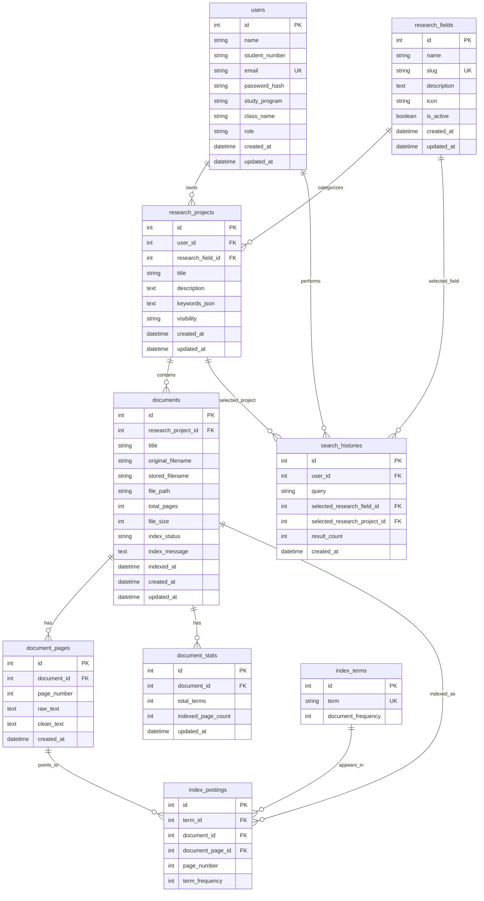

# Litera Implementation Plan

## 1. Ringkasan Audit

Litera saat ini adalah prototype frontend hasil export Figma Make. Desain visual, layout, komponen, dan mock data sudah tersedia cukup lengkap untuk menggambarkan pengalaman pengguna MVP, tetapi seluruh fitur bisnis masih simulasi di sisi client.

Temuan utama:

- Repository hanya berisi frontend Vite/React dan dokumen produk (`PRD.md`, `AGENTS.md`).
- Belum ada backend, database, REST API, authentication nyata, upload PDF nyata, PDF extraction, indexing, atau search engine.
- Routing masih state-based melalui `AppContext` dan `Page`, bukan URL routing.
- Semua data domain berasal dari `src/app/components/data.ts`.
- Login, register, create collection, upload, search, admin CRUD, dan re-index masih memakai local state, `setTimeout`, dan toast.
- Build/dev awal gagal karena dependency belum terpasang dan belum ada lockfile.
- Sebelum baseline tooling dirapikan, belum ada script lint, typecheck, atau test.

Scope audit ini tidak mengubah desain visual dan tidak mengimplementasikan backend atau fitur bisnis.

## 2. Stack Teknologi Frontend Aktual

Stack yang ditemukan dari `package.json`, `vite.config.ts`, dan source code:

- Runtime/build: Vite 6.
- UI framework: React 18 + TypeScript TSX.
- Styling: Tailwind CSS 4 melalui `@tailwindcss/vite`, custom CSS variables di `src/styles/theme.css`.
- UI primitives: Radix UI dan komponen shadcn-style di `src/app/components/ui`.
- Icon: `lucide-react`.
- Toast: `sonner`.
- Chart-ready dependency: `recharts`, walau belum dipakai di halaman utama.
- Routing dependency: `react-router` ada, tetapi belum dipakai.
- Additional dependencies hasil Figma Make: MUI, Emotion, Motion, React DnD, carousel, drawer, tabs, select, dan primitives lain.

Package manager yang dipakai untuk tahap berikutnya: npm. File `pnpm-workspace.yaml` berasal dari export, tetapi workflow proyek memakai `npm install` dan `package-lock.json`.

## 3. Struktur Folder Aktual

```text
.
|-- AGENTS.md
|-- ATTRIBUTIONS.md
|-- PRD.md
|-- README.md
|-- default_shadcn_theme.css
|-- index.html
|-- package.json
|-- pnpm-workspace.yaml
|-- postcss.config.mjs
|-- vite.config.ts
|-- src/
    |-- main.tsx
    |-- app/
    |   |-- App.tsx
    |   |-- context.tsx
    |   |-- components/
    |       |-- AdminDashboard.tsx
    |       |-- CollectionDetailPage.tsx
    |       |-- CreateCollectionPage.tsx
    |       |-- HomePage.tsx
    |       |-- LoginPage.tsx
    |       |-- Navbar.tsx
    |       |-- ResearchFieldsPage.tsx
    |       |-- SearchResultsPage.tsx
    |       |-- StudentDashboard.tsx
    |       |-- UploadModal.tsx
    |       |-- data.ts
    |       |-- ui.tsx
    |       |-- figma/
    |       |-- ui/
    |-- imports/
    |-- styles/
```

Folder yang ditambahkan pada tahap baseline:

```text
docs/
src/test/
```

## 4. Halaman dan Reusable Components Tersedia

Halaman utama:

- `LoginPage`: login dan register dalam satu komponen, masih simulasi.
- `HomePage`: beranda, hero, search bar, filter bidang, statistik, bidang populer, koleksi terbaru.
- `SearchResultsPage`: hasil pencarian mock, filter bidang, sorting relevansi/tanggal, kartu hasil, halaman relevan mock.
- `ResearchFieldsPage`: daftar bidang dan detail bidang.
- `CollectionDetailPage`: detail koleksi, daftar PDF, status indexing, filter status, quick search.
- `StudentDashboard`: ringkasan mahasiswa, koleksi, PDF, indexing, riwayat, profil.
- `CreateCollectionPage`: form pembuatan koleksi mock.
- `AdminDashboard`: ringkasan admin, bidang penelitian, pengguna, koleksi, dokumen, monitoring indexing, settings.
- `UploadModal`: multiple PDF upload UI dengan simulasi progress dan indexing.
- `Navbar`: navigasi global, search, avatar menu, upload button.

Reusable components yang aman dipertahankan:

- `Button`, `Badge`, `Card`, `InputField`, `TextareaField`, `Avatar`, `Separator`, `Chip`, `StatusDot`, `ProgressBar` dari `src/app/components/ui.tsx`.
- Komponen Radix/shadcn-style di `src/app/components/ui/*`, misalnya dialog, sheet, select, tabs, table, tooltip, sidebar, card, input, textarea.
- Data mock di `src/app/components/data.ts` perlu dipertahankan sampai API integration siap, agar desain tetap hidup selama transisi.

## 5. Gap Analysis terhadap PRD

| Area PRD | Status Saat Ini | Gap |
|---|---|---|
| Register dan login | UI tersedia, simulasi | Belum ada backend auth, JWT, password hash, session persistence |
| Role admin/mahasiswa | UI admin dan mahasiswa tersedia | Role masih hardcoded; belum ada permission guard |
| CRUD bidang penelitian | UI admin tersedia | Belum persisten, belum validasi slug/status aktif |
| CRUD koleksi penelitian | UI form dan list tersedia | Belum persisten, belum edit/delete nyata |
| Upload multiple PDF | Modal UI tersedia | Belum mengirim file ke server, belum validasi server, belum local storage PDF |
| Ekstraksi teks PDF | Belum ada | Perlu PyMuPDF per halaman |
| Preprocessing Indonesia | Belum ada | Perlu tokenizing, stopword removal, stemming Sastrawi |
| Inverted index custom | Belum ada | Perlu tabel/postings eksplisit, bukan search library |
| Ranking TF-IDF | Hanya label/mock score | Perlu rumus dan query processor nyata |
| Search global/field/collection | UI tersedia, data mock | Perlu REST search dengan filter dan permission |
| Snippet dan halaman relevan | Mock excerpt dan page list | Perlu snippet dari text pages dan ranking page |
| Status indexing | UI tersedia, simulasi | Perlu status persisted: pending, processing, indexed, failed |
| PDF open | Tombol tersedia | Perlu file endpoint dan access control |
| Responsive | Desain tersedia | Harus diverifikasi setelah integrasi data nyata |
| README | Minimal Figma export | Perlu instruksi setup/run lengkap |

## 6. Rancangan Arsitektur Final

Arsitektur MVP yang disarankan:

```text
React/Vite frontend
  -> REST API client
  -> FastAPI backend
  -> SQLAlchemy models
  -> SQLite database
  -> Local uploads/ PDF storage
  -> Custom indexing/search services
```

Keputusan penting:

- Frontend hasil Figma Make dipertahankan. Integrasi API dilakukan bertahap lewat service layer dan typed DTO, bukan rebuild UI.
- Backend menggunakan FastAPI karena cocok untuk REST API, background task sederhana, dan Python PDF/NLP ecosystem.
- SQLite dipakai untuk MVP agar mudah dijalankan lokal dan cukup untuk dataset tugas mata kuliah.
- PDF disimpan di folder lokal `uploads/`, metadata dan index disimpan di SQLite.
- Search memakai custom inverted index dan TF-IDF eksplisit. Tidak menggunakan Elasticsearch, vector database, embedding, semantic search, atau library search engine siap pakai.
- PDF scan tanpa text layer diberi status `failed`; OCR berada di luar scope MVP.

## 7. Struktur Folder Backend yang Direncanakan

```text
backend/
|-- app/
|   |-- main.py
|   |-- api/
|   |   |-- deps.py
|   |   |-- routes/
|   |       |-- auth.py
|   |       |-- fields.py
|   |       |-- projects.py
|   |       |-- documents.py
|   |       |-- search.py
|   |       |-- admin.py
|   |-- core/
|   |   |-- config.py
|   |   |-- security.py
|   |-- db/
|   |   |-- session.py
|   |   |-- models.py
|   |   |-- seed.py
|   |-- schemas/
|   |-- repositories/
|   |-- services/
|       |-- pdf_extractor.py
|       |-- text_preprocessor.py
|       |-- indexer.py
|       |-- searcher.py
|-- tests/
|-- uploads/
|-- requirements.txt
```

## 8. ERD



## 9. Endpoint REST API yang Direncanakan

Authentication:

- `POST /api/v1/auth/register`
- `POST /api/v1/auth/login`
- `GET /api/v1/auth/me`
- `POST /api/v1/auth/logout` atau client-side token clear untuk MVP

Research fields:

- `GET /api/v1/fields`
- `GET /api/v1/fields/{field_id}`
- `POST /api/v1/fields` admin
- `PATCH /api/v1/fields/{field_id}` admin
- `DELETE /api/v1/fields/{field_id}` admin, ditolak jika masih dipakai koleksi aktif

Research projects / collections:

- `GET /api/v1/projects`
- `GET /api/v1/projects/me`
- `GET /api/v1/projects/{project_id}`
- `POST /api/v1/projects`
- `PATCH /api/v1/projects/{project_id}` owner/admin
- `DELETE /api/v1/projects/{project_id}` owner/admin

Documents:

- `GET /api/v1/documents`
- `GET /api/v1/documents/my`
- `GET /api/v1/projects/{project_id}/documents`
- `POST /api/v1/projects/{project_id}/documents` multipart multiple PDF
- `GET /api/v1/documents/{document_id}`
- `PATCH /api/v1/documents/{document_id}` owner/admin
- `DELETE /api/v1/documents/{document_id}` owner/admin
- `POST /api/v1/documents/{document_id}/reindex` owner/admin
- `GET /api/v1/documents/{document_id}/file`

Search:

- `GET /api/v1/search?query=&field_id=&project_id=&owner_id=&year_from=&year_to=&status=&sort=`
- `GET /api/v1/search/suggestions?query=`
- `GET /api/v1/search/history`

Admin:

- `GET /api/v1/admin/users`
- `PATCH /api/v1/admin/users/{user_id}`
- `GET /api/v1/admin/projects`
- `GET /api/v1/admin/documents`
- `GET /api/v1/admin/indexing`
- `POST /api/v1/admin/indexing/reindex`

## 10. Alur Automatic PDF Indexing

```text
User memilih koleksi
-> Upload satu atau banyak PDF
-> Backend validasi ekstensi, MIME, ukuran, dan kepemilikan koleksi
-> File disimpan dengan nama aman di uploads/
-> Metadata documents dibuat dengan status pending
-> Background task mengubah status menjadi processing
-> PyMuPDF ekstrak teks per halaman
-> Jika semua halaman kosong, status failed dan index_message menjelaskan PDF kemungkinan scan
-> Teks dinormalisasi
-> Tokenizing
-> Stopword removal Bahasa Indonesia
-> Stemming Bahasa Indonesia dengan Sastrawi
-> Simpan raw_text dan clean_text per halaman
-> Hapus posting lama jika reindex
-> Bentuk posting term, document, page, term_frequency
-> Hitung document_stats dan document_frequency per term
-> Status document menjadi indexed
```

Status dokumen:

- `pending`: metadata sudah dibuat, belum mulai proses.
- `processing`: file sedang diekstrak dan diindeks.
- `indexed`: postings berhasil dibuat.
- `failed`: proses gagal dengan pesan yang dapat ditampilkan di UI.

## 11. Format Inverted Index

Format konseptual yang harus dapat dipresentasikan:

```json
{
  "snmp": {
    "document_frequency": 3,
    "documents": {
      "17": {
        "frequency": 18,
        "pages": {
          "2": 4,
          "4": 9,
          "7": 5
        }
      }
    }
  }
}
```

Representasi database:

- `index_terms.term`: token hasil stemming.
- `index_terms.document_frequency`: jumlah dokumen indexed yang mengandung term.
- `index_postings.term_id`: relasi ke term.
- `index_postings.document_id`: dokumen tempat term muncul.
- `index_postings.document_page_id`: halaman tempat term muncul.
- `index_postings.page_number`: nomor halaman untuk output UI.
- `index_postings.term_frequency`: frekuensi term di halaman tersebut.
- `document_stats.total_terms`: total token dokumen setelah preprocessing.
- `document_pages.clean_text`: teks halaman yang sudah dibersihkan untuk snippet.

## 12. Rumus Ranking TF-IDF

Pipeline query sama dengan pipeline dokumen:

```text
lowercase -> normalize -> tokenize -> stopword removal -> stemming
```

Rumus:

```text
tf(term, doc) = total_frequency(term, doc) / total_terms(doc)
idf(term) = log((N + 1) / (df(term) + 1)) + 1
score(doc, query) = sum(tf(term, doc) * idf(term)) untuk setiap term query
```

Keterangan:

- `N`: jumlah dokumen dengan status `indexed` dalam scope pencarian.
- `df(term)`: jumlah dokumen indexed dalam scope yang mengandung term.
- Halaman relevan dipilih dari page posting dengan kontribusi term tertinggi.
- Snippet diambil dari `document_pages.clean_text` atau `raw_text` terdekat dengan term query.
- Backend mengembalikan snippet sebagai plain text plus metadata term highlight, bukan HTML mentah.

## 13. Tahapan Implementasi

### Tahap 1 - Dokumentasi audit

Pekerjaan:

- Buat `docs/IMPLEMENTATION_PLAN.md`.
- Catat stack aktual, struktur repo, halaman tersedia, gap PRD, arsitektur target, ERD, endpoint, indexing, inverted index, TF-IDF, risiko, asumsi, dan setup.

Acceptance criteria:

- Dokumen ada dan mencakup seluruh output wajib.
- Tidak ada fitur bisnis baru.
- Tidak ada perubahan visual.

### Tahap 2 - Baseline frontend tooling

Pekerjaan:

- Gunakan npm dan buat `package-lock.json`.
- Tambah `.gitignore`.
- Tambah TypeScript config.
- Tambah ESLint.
- Tambah Vitest + testing-library smoke tests.
- Tambah scripts `dev`, `build`, `lint`, `typecheck`, `test`.
- Perbarui README.

Acceptance criteria:

- `npm install` berhasil.
- `npm run dev -- --host=127.0.0.1 --port=5173` dapat menjalankan frontend.
- `npm run lint` berhasil.
- `npm run typecheck` berhasil.
- `npm run test` berhasil.
- `npm run build` berhasil.
- Desain tetap mengikuti export Figma Make.

### Tahap 3 - Backend scaffold, database, dan auth

Pekerjaan:

- Buat FastAPI app, SQLAlchemy, SQLite, model awal, seed bidang penelitian, password hash, JWT, role guard.

Acceptance criteria:

- API docs dapat dibuka.
- Register, login, dan `me` berjalan.
- Test auth/model lulus.

### Tahap 4 - CRUD bidang dan koleksi

Pekerjaan:

- Implement field admin CRUD dan project CRUD owner/admin.
- Pertahankan frontend mock tanpa integrasi API pada tahap ini.

Acceptance criteria:

- Field dan koleksi tersimpan di SQLite.
- Permission owner/admin berjalan.
- Tidak ada backend upload, indexing, search endpoint, atau perubahan visual.

### Tahap 5 - Upload dan indexing PDF

Pekerjaan:

- Implement multiple upload, local PDF storage, PyMuPDF extraction, preprocessing, Sastrawi stemming, document pages, postings, status indexing, dan reindex.

Acceptance criteria:

- PDF berbasis teks menjadi `indexed`.
- PDF scan/tanpa teks menjadi `failed`.
- Inverted index tersimpan eksplisit.

### Tahap 6 - Search TF-IDF

Pekerjaan:

- Implement global search, field search, collection search, snippet, relevant pages, sorting/filter dasar, dan search history.

Acceptance criteria:

- Hasil terurut dengan TF-IDF.
- Filter bidang dan koleksi bekerja.
- Hasil menampilkan title, owner, collection, field, snippet, pages, score, upload date, dan PDF link.

### Tahap 7 - Admin, hardening, dan demo dataset

Pekerjaan:

- Lengkapi admin users/projects/documents/indexing, retry reindex, README backend, seed demo dataset, tests, dan responsive verification.

Acceptance criteria:

- Acceptance criteria PRD MVP terpenuhi.
- Dataset demo 20-50 PDF dapat diuji.
- Checks frontend dan backend lulus.

## 14. Risiko Teknis dan Mitigasi

- Risiko: desain Figma berubah jika komponen dirombak. Mitigasi: pertahankan JSX/CSS existing, ganti sumber data lewat API adapter saja.
- Risiko: mock data bercampur dengan data API. Mitigasi: buat typed DTO dan mapper bertahap, lalu hapus mock setelah parity.
- Risiko: SQLite lock saat indexing dan upload bersamaan. Mitigasi: transaksi pendek, WAL mode, background task sederhana, dan batas ukuran upload.
- Risiko: PyMuPDF gagal untuk PDF scan. Mitigasi: status `failed` dengan pesan jelas; OCR di luar MVP.
- Risiko: stemming Sastrawi lambat untuk banyak halaman. Mitigasi: cache hasil stemming term, batas file 50 MB, dan reindex per dokumen.
- Risiko: XSS dari snippet. Mitigasi: backend kirim plain text; frontend melakukan highlight aman.
- Risiko: file PDF rahasia terbuka. Mitigasi: endpoint file harus cek user role, visibility, owner, dan project access.
- Risiko: ranking sulit dijelaskan jika terlalu kompleks. Mitigasi: gunakan TF-IDF klasik dengan formula terdokumentasi dan tabel postings eksplisit.

## 15. Asumsi Teknis

- npm adalah package manager utama.
- Frontend tetap berjalan sebagai Vite app di port 5173.
- Backend, saat dibuat nanti, berjalan di `http://127.0.0.1:8000`.
- SQLite cukup untuk MVP dan dataset demo kelas.
- PDF MVP hanya PDF berbasis teks; OCR tidak termasuk.
- Visibility awal cukup `public` dan `private`.
- Native browser PDF viewer cukup untuk MVP membuka PDF.
- `react-router` dapat dipakai nanti untuk URL routing, tetapi state-based navigation tidak diubah pada tahap baseline.

## 16. Langkah Setup dan Run

Frontend:

```bash
npm install
npm run dev -- --host=127.0.0.1 --port=5173
npm run lint
npm run typecheck
npm run test
npm run build
```

Backend yang direncanakan untuk tahap berikutnya:

```bash
cd backend
python -m venv .venv
.\.venv\Scripts\Activate.ps1
pip install -r requirements.txt
uvicorn app.main:app --reload --host 127.0.0.1 --port 8000
```

## 17. Pertanyaan Terbuka

Tidak ada pertanyaan produk yang menghalangi tahap 1 dan tahap 2. Keputusan detail backend dapat dikunci saat mulai tahap 3.

## 18. Progress Tahap 3

Status: selesai untuk backend scaffold, database foundation, Alembic migration, seed data, dan JWT authentication.

Yang sudah dibuat:

- Folder `backend/` dengan FastAPI app modular.
- SQLAlchemy 2-style ORM untuk seluruh tabel fondasi PRD: users, research fields, research projects, documents, document pages, document stats, index terms, index postings, dan search histories.
- Alembic initial migration sebagai sumber pembuatan database development.
- Pydantic Settings dan `.env.example`.
- Password hashing Argon2 melalui `pwdlib[argon2]`.
- JWT access token dengan PyJWT.
- Endpoint `GET /api/v1/health`, `POST /api/v1/auth/register`, `POST /api/v1/auth/login`, dan `GET /api/v1/auth/me`.
- Dependency `get_db`, `get_current_user`, `get_current_active_user`, dan `require_admin` untuk tahap berikutnya.
- Seed data idempotent berisi akun admin demo, 2 mahasiswa demo, 6 bidang penelitian, dan 2 koleksi demo.
- Test backend untuk health, authentication, migration/model relationship, unique constraint, cascade sederhana, dan Argon2 hash.

Yang sengaja belum dibuat:

- CRUD bidang/koleksi melalui API.
- Upload PDF.
- Ekstraksi teks PDF.
- Preprocessing, inverted index runtime, TF-IDF, dan search endpoint.
- Integrasi frontend ke backend.

Perintah verifikasi tahap 3:

```powershell
cd backend
python -m venv .venv
.\.venv\Scripts\Activate.ps1
python -m pip install --upgrade pip
pip install -r requirements.txt
alembic upgrade head
python -m app.services.seed
pytest
uvicorn app.main:app --reload --host 127.0.0.1 --port 8000
```

Endpoint verifikasi:

- `http://127.0.0.1:8000/api/v1/health`
- `http://127.0.0.1:8000/docs`

## 19. Progress Tahap 4

Status: selesai untuk CRUD REST API bidang penelitian dan koleksi penelitian beserta authorization owner/admin.

Yang sudah dibuat:

- Endpoint `/api/v1/fields` untuk daftar, detail, create, update, dan delete bidang penelitian.
- Endpoint `/api/v1/projects` untuk daftar, daftar milik pengguna aktif, detail, create, update, dan delete koleksi penelitian.
- Schema Pydantic untuk pagination, field, project, owner summary, dan field summary.
- Service layer ringan untuk slug field, validasi field aktif, pagination, visibility project, dan aturan owner/admin.
- Seed data idempotent diperbarui agar satu koleksi demo tetap public dan satu koleksi demo private.
- Test backend untuk field CRUD admin-only, field inactive, project creation, project visibility, owner/admin update/delete, `/projects/me`, dan idempotensi seed.

Aturan akses tahap 4:

- Semua endpoint field dan project membutuhkan JWT.
- Mahasiswa hanya melihat bidang aktif.
- Admin dapat memakai `include_inactive=true` untuk daftar bidang.
- Bidang inactive tidak dapat dipakai saat create/update koleksi baru.
- Project private disembunyikan sebagai `404` dari mahasiswa non-owner.
- Project dapat diubah/dihapus oleh owner atau admin.

Yang sengaja belum dibuat:

- Integrasi frontend ke backend.
- Upload PDF.
- Ekstraksi PDF, preprocessing, inverted index runtime, TF-IDF, dan search endpoint.
- Perubahan schema database baru; model awal sudah mencukupi, sehingga tidak ada migration kosong.

## 20. Progress Tahap 5

Status: selesai untuk CRUD dokumen PDF, multiple upload, ekstraksi teks, preprocessing Bahasa Indonesia, dan custom inverted index.

Yang sudah dibuat:

- Endpoint `POST /api/v1/projects/{project_id}/documents` untuk multiple upload PDF memakai multipart field `files`.
- Endpoint `GET /api/v1/projects/{project_id}/documents` dengan pagination, filter status, dan search judul/filename.
- Endpoint `GET /api/v1/documents/{document_id}` untuk metadata lengkap, owner, project, field, dan stats.
- Endpoint `GET /api/v1/documents/{document_id}/file` untuk membuka PDF dari metadata database.
- Endpoint `PATCH /api/v1/documents/{document_id}` untuk mengubah judul metadata.
- Endpoint `DELETE /api/v1/documents/{document_id}` untuk menghapus file fisik dan index terkait.
- Endpoint `POST /api/v1/documents/{document_id}/reindex` untuk membersihkan index lama dan menjalankan indexing ulang.
- Service `file_storage.py` untuk validasi ekstensi, MIME, magic bytes `%PDF-`, ukuran file, UUID filename, dan path containment.
- Service `pdf_extractor.py` memakai PyMuPDF `page.get_text("text", sort=True)` per halaman.
- Service `preprocessing.py` untuk Unicode normalization, case folding, URL/email removal, tokenizing, stopword removal Bahasa Indonesia, stemming Sastrawi, dan whitelist istilah teknis.
- Service `indexer.py` untuk membangun `document_pages`, `document_stats`, `index_terms`, dan `index_postings`.
- Background indexing memakai FastAPI `BackgroundTasks` dan membuat session database baru sendiri.
- Test backend untuk file validation, permission, extraction, preprocessing, indexing, reindex, delete cleanup, dan regression tahap 3/4.

Dependency baru:

- `python-multipart` untuk multipart upload.
- `PyMuPDF` untuk ekstraksi teks PDF.
- `Sastrawi` untuk stopword dan stemming Bahasa Indonesia.

Konfigurasi baru:

```env
UPLOAD_DIR=uploads
MAX_PDF_SIZE_MB=15
```

Format inverted index runtime:

```json
{
  "snmp": {
    "17": {
      "pages": {
        "1": 2,
        "3": 5
      },
      "frequency": 7
    }
  }
}
```

Representasi database:

- `index_terms.term`: token hasil preprocessing/stemming.
- `index_terms.document_frequency`: jumlah dokumen unik yang mengandung term.
- `index_postings.term_id`: relasi term.
- `index_postings.document_id`: relasi dokumen.
- `index_postings.page_number`: halaman 1-based.
- `index_postings.term_frequency`: frekuensi term pada halaman.
- `document_stats.total_terms`: total token dokumen.
- `document_stats.indexed_page_count`: jumlah halaman yang diproses.

Whitelist istilah teknis tahap 5:

```text
snmp, olt, onu, pppoe, ftth, mikrotik, routeros, api, qos, nms,
oid, rest, grafana, latency, bandwidth, throughput, packetloss
```

Keputusan teknis:

- Tidak ada migration baru karena initial schema sudah memiliki unique constraint `index_postings(term_id, document_id, page_number)`, unique `document_stats(document_id)`, dan index relevan.
- Reindex membersihkan index lama sebelum background task agar duplicate postings tidak terjadi.
- File upload yang gagal validasi dilaporkan per item tanpa membatalkan file valid dalam batch.
- PDF scan/image-only menjadi `failed`; OCR tetap di luar scope MVP.
- Traceback mentah tidak disimpan ke response API atau `index_message`.

Yang sengaja belum dibuat:

- Endpoint search dan ranking TF-IDF.
- Snippet hasil pencarian dan relevant pages untuk search.
- Integrasi frontend ke API.
- OCR, Celery/Redis, Elasticsearch, vector database, embedding, atau semantic search.

## 21. Progress Tahap 6

Status: selesai untuk search engine TF-IDF, cosine similarity, snippet, relevant pages, filter pencarian, pencarian katalog, dan search history.

Yang sudah dibuat:

- Endpoint `GET /api/v1/search` untuk global PDF search dengan filter `research_field_id`, `research_project_id`, `owner_id`, pagination, dan sorting.
- Endpoint `GET /api/v1/search/catalog` untuk pencarian katalog bidang dan koleksi dengan pencocokan case-insensitive.
- Endpoint `GET /api/v1/search/history` untuk riwayat pencarian user aktif.
- Endpoint `DELETE /api/v1/search/history` untuk menghapus riwayat user aktif.
- Service `ranking.py` untuk rumus TF-IDF dan cosine similarity eksplisit.
- Service `snippet.py` untuk snippet plain text dari `raw_text` halaman terbaik.
- Service `search_service.py` untuk query preprocessing, candidate retrieval dari postings, scoped IDF, ranking, relevant pages, catalog, dan history.
- Schema `search.py` untuk response search, catalog, dan history.
- Test backend untuk preprocessing query, ranking, candidate retrieval, filters, privacy, relevant pages, snippet, catalog, history, dan regression tahap 3-5.

Rumus ranking:

```text
tf_weight(tf) =
  0 jika tf = 0
  1 + ln(tf) jika tf > 0

idf(term) = ln((N + 1) / (df(term) + 1)) + 1

weight(term, document) = tf_weight(term_frequency) * idf(term)

cosine_similarity(query, document) =
  dot_product(query_vector, document_vector) / (query_norm * document_norm)
```

Scoped IDF:

- `N` adalah jumlah dokumen `indexed` yang dapat diakses user dalam filter aktif.
- `df(term)` adalah jumlah dokumen unik dalam scope tersebut yang memiliki term.
- `index_terms.document_frequency` tetap menyimpan statistik global index, tetapi ranking search menghitung DF sesuai visibility dan filter.

Strategi candidate retrieval:

- Query diproses dengan pipeline yang sama seperti dokumen.
- Search mengambil `index_terms` sesuai processed query terms.
- Kandidat diambil dari `index_postings`.
- Scope menerapkan status `indexed`, visibility public/private, owner/admin, field, project, dan owner filter.
- Search tidak membaca ulang PDF dan tidak melakukan full scan `document_pages` untuk mengambil kandidat.

Strategi relevant pages:

- Page score dihitung dari kontribusi TF-IDF term query pada setiap halaman.
- Halaman diurutkan berdasarkan skor tertinggi, lalu nomor halaman terkecil jika skor sama.
- Response mengembalikan maksimal 5 halaman dan `best_page` 1-based.

Strategi snippet:

- Snippet dibuat dari `document_pages.raw_text`, bukan `clean_text`.
- Surface words pada raw text diproses ulang untuk dicocokkan dengan stem query.
- Snippet dikirim sebagai plain text yang di-escape, tanpa HTML highlight.
- Response menyertakan `matched_terms` agar frontend dapat melakukan highlight secara aman.

Aturan privacy:

- User tanpa token ditolak.
- Dokumen private hanya tampil untuk owner atau admin.
- Project private user lain pada filter `research_project_id` menghasilkan `404`.
- Result count dan snippet tidak memasukkan dokumen private yang tidak dapat diakses.
- Admin dapat mencari seluruh dokumen indexed termasuk private.
- Field nonaktif tetap boleh dipakai sebagai filter search agar dokumen lama masih bisa ditemukan oleh user yang berhak.

Keputusan teknis:

- Tidak ada migration baru karena tabel `search_histories` sudah tersedia untuk `query`, selected field, selected project, result count, dan timestamp.
- Filter `owner_id` dipakai saat search, tetapi tidak dipersist di history karena model awal tidak memiliki kolom `owner_id`.
- Catalog search sengaja bukan TF-IDF PDF search; fungsinya mencari bidang/koleksi dari metadata.

Yang sengaja belum dibuat:

- Integrasi frontend ke API.
- Admin dashboard API lengkap untuk user/document moderation.
- OCR, Elasticsearch, vector database, embedding, semantic search, atau library search engine siap pakai.

## 22. Progress Tahap 7A

Status: selesai untuk integrasi frontend dasar ke REST API auth, profil, bidang penelitian, dan koleksi penelitian.

Yang sudah dibuat:

- `.env.example` frontend dengan `VITE_API_BASE_URL=http://127.0.0.1:8000/api/v1`.
- Typed API client native `fetch` di `src/lib/api-client.ts`.
- Error wrapper aman di `src/lib/api-error.ts`.
- Token storage terpusat di `src/lib/auth-storage.ts` memakai `localStorage`.
- Type DTO frontend untuk auth, pagination, field, dan project.
- Service layer frontend `auth-service`, `field-service`, dan `project-service`.
- `AuthContext` dengan `user`, `token`, `isAuthenticated`, `isLoading`, `login`, `register`, `logout`, dan `refreshProfile`.
- Login dan register memakai endpoint backend nyata.
- App startup membaca token tersimpan dan memvalidasi lewat `/auth/me`.
- Navbar memakai user aktif, role, avatar inisial, dan logout nyata.
- Daftar/detail bidang memakai `/fields`.
- CRUD bidang admin memakai API, termasuk aktivasi/nonaktif dan handling error delete 409 dari backend.
- Beranda memakai daftar bidang dan koleksi publik dari API.
- Dashboard mahasiswa bagian “Koleksi Saya” memakai `/projects/me`.
- Detail koleksi memakai `/projects/{id}`.
- Form tambah/edit koleksi memakai `/projects` dan `/projects/{id}`.
- Hapus koleksi memakai `DELETE /projects/{id}` dengan konfirmasi browser.
- Test frontend untuk API client, AuthContext, fields page, collection detail owner permissions, dan smoke app.

Halaman/area yang masih mock atau placeholder:

- Upload PDF dan progress upload.
- Daftar PDF pada detail koleksi.
- Status indexing/re-index dari UI.
- Search TF-IDF UI dan search history UI.
- Dashboard admin selain CRUD bidang penelitian.
- Statistik agregat repository yang belum memiliki endpoint khusus.

Keputusan teknis:

- Native `fetch` dipertahankan; Axios tidak ditambahkan.
- State-based navigation tetap dipakai agar desain export tidak dirombak.
- Tidak ada fallback diam-diam ke mock untuk area auth, fields, dan projects yang sudah terintegrasi.
- Angka yang tidak tersedia dari API, seperti total PDF per bidang atau kontributor, ditampilkan sebagai tidak tersedia atau placeholder eksplisit, bukan data mock.
- Token JWT disimpan di `localStorage` untuk MVP lokal; production perlu evaluasi cookie HttpOnly.

Acceptance criteria Tahap 7A:

- Login API terhubung.
- Register API terhubung.
- Token tersimpan terpusat dan refresh browser memvalidasi sesi.
- Logout membersihkan token dan auth state.
- Profil user aktif tampil di navbar dan dashboard.
- Role admin/student dikenali UI.
- Daftar dan detail bidang memakai API asli.
- CRUD bidang admin memakai API asli.
- Daftar, detail, create, update, delete koleksi memakai API asli.
- Aksi edit/delete koleksi tampil hanya untuk owner/admin.
- API error tampil sebagai error state/toast.
- Mock tidak dipakai diam-diam pada area terintegrasi.
- Desain visual tidak di-rebuild.

Perintah verifikasi Tahap 7A:

```powershell
cd backend
.\.venv\Scripts\Activate.ps1
python -m pytest

cd ..
npm run lint
npm run typecheck
npm run test
npm run build
```

Rekomendasi Tahap 7B:

- Integrasikan endpoint dokumen PDF ke detail koleksi dan dashboard.
- Hubungkan upload multiple PDF ke backend multipart.
- Tampilkan status indexing nyata dan tombol re-index owner/admin.
- Integrasikan UI search TF-IDF global, filter bidang, filter koleksi, snippet, relevant pages, dan PDF open endpoint.
- Tambahkan endpoint agregasi statistik bila dashboard membutuhkan angka repository nyata.

## 23. Progress Tahap 7B-1

Status: selesai untuk integrasi frontend dokumen PDF pada detail koleksi dan modal upload tanpa mengubah desain visual besar.

Yang sudah dibuat:

- Type DTO frontend dokumen di `src/types/document.ts`.
- Service dokumen berbasis native `fetch` di `src/services/document-service.ts`.
- Upload multiple PDF memakai `FormData` dengan field multipart `files`; header `Content-Type` tidak diset manual.
- Helper buka PDF melalui fetch blob ber-Authorization, object URL, `window.open`, dan revoke object URL terjadwal. Token tidak pernah diletakkan di URL.
- Hook `useProjectDocuments` untuk mengambil daftar PDF koleksi dari `/projects/{project_id}/documents`.
- Hook `useIndexingPolling` dengan interval 3 detik, hanya aktif saat ada dokumen `pending` atau `processing`, dan berhenti saat semua dokumen terminal atau komponen unmount.
- `CollectionDetailPage` memakai daftar dokumen API nyata, status indexing nyata, pesan gagal indexing, hitungan progress, open PDF, edit judul, re-index, dan delete PDF.
- Aksi mutasi PDF hanya tampil untuk owner/admin; non-owner tetap dapat membuka PDF yang bisa dibaca.
- `UploadModal` memakai daftar koleksi dari `/projects/me` atau target koleksi saat ini, validasi PDF client-side, upload batch ke backend, dan menampilkan hasil per file dari response backend.
- App context memiliki `documentsRefreshKey` dan `notifyDocumentsChanged` agar list PDF refresh setelah upload/mutasi.
- README root dan backend README diperbarui sesuai status integrasi.
- Test frontend ditambahkan untuk document service, upload modal, daftar dokumen/status/permission/mutasi, dan polling indexing.

Yang sengaja belum dibuat pada tahap ini:

- Integrasi UI search TF-IDF.
- UI search history.
- Backend baru, migration baru, database baru, authentication baru, atau perubahan search engine.
- Rebuild desain, penggantian warna/typography/spacing, atau penghapusan mock data global yang belum masuk area dokumen.

Keputusan teknis:

- Area dokumen yang sudah terintegrasi tidak fallback ke mock data.
- Pencarian kecil pada daftar PDF detail koleksi masih difilter client-side dari daftar dokumen koleksi yang dimuat, sedangkan TF-IDF search tetap menunggu tahap berikutnya.
- Admin yang membuka koleksi milik user lain tetap dapat upload ke target koleksi detail; jika koleksi itu tidak muncul dari `/projects/me`, modal menampilkan opsi "Koleksi saat ini".
- Upload progress browser tidak memakai progress event karena native `fetch` belum menyediakan upload progress standar; UI menampilkan status upload dan hasil indexing dari backend.

Perintah verifikasi Tahap 7B-1:

```powershell
cd backend
.\.venv\Scripts\Activate.ps1
python -m pytest

cd ..
npm run lint
npm run typecheck
npm run test
npm run build
```

Rekomendasi tahap berikutnya:

- Integrasikan UI search TF-IDF global, filter bidang, dan filter koleksi.
- Tampilkan snippet plain text, matched terms, skor relevansi, dan halaman relevan dari endpoint search.
- Hubungkan search history UI.
- Tambahkan endpoint agregasi statistik jika dashboard membutuhkan angka repository yang tidak bisa dihitung dari endpoint saat ini.

## 24. Progress Tahap 7B-2

Status: selesai untuk integrasi frontend search engine TF-IDF, filter bidang/koleksi, catalog search, scoped search, snippet, relevant pages, PDF page open, dan search history.

Yang sudah dibuat:

- Type DTO frontend search di `src/types/search.ts`.
- Service search di `src/services/search-service.ts` untuk `/search`, `/search/catalog`, `/search/history`, dan `DELETE /search/history`.
- Hook `useLiteratureSearch`, `useCatalogSearch`, dan `useSearchHistory`.
- Helper highlight aman di `src/lib/highlight-text.tsx` yang membangun React nodes dan tidak memakai `dangerouslySetInnerHTML`.
- `SearchResultsPage` memakai endpoint TF-IDF nyata, bukan mock result.
- Hasil pencarian menampilkan skor relevansi, snippet plain text, matched term highlight, field, collection, owner, upload date, relevant pages, best page, pagination, sorting, retry, empty state, dan error state.
- Filter hasil berdasarkan `research_field_id` dan `research_project_id` dengan query ulang ke backend.
- Tombol halaman relevan dan tombol buka PDF memakai fetch blob ber-Authorization, lalu membuka object URL dengan fragment `#page=...`; token tidak pernah dimasukkan ke URL.
- Search bar beranda melakukan global search dengan field scope terpilih.
- Search bar beranda menampilkan catalog suggestions dari `/search/catalog` untuk bidang dan koleksi.
- Keyword chips beranda mengarah ke search API.
- Navbar search mengarah ke halaman search dengan query valid.
- Detail bidang mengirim scoped search memakai `researchFieldId`.
- Detail koleksi mengirim scoped search memakai `researchProjectId`.
- Dashboard mahasiswa tab riwayat memakai `/search/history`, dapat mengulang query beserta filter, dan dapat menghapus history milik user aktif.
- Test frontend ditambahkan untuk search service, highlight helper, home search/catalog, search results, dashboard history, scoped field search, dan scoped collection search.

Kontrak endpoint frontend yang dipakai:

- `GET /api/v1/search?q=&research_field_id=&research_project_id=&owner_id=&page=&page_size=&sort_by=`
- `GET /api/v1/search/catalog?q=&limit=`
- `GET /api/v1/search/history?page=&page_size=`
- `DELETE /api/v1/search/history`

Keputusan teknis:

- Tidak ada fallback diam-diam ke mock untuk halaman hasil pencarian dan search history.
- Catalog search hanya metadata bidang/koleksi; pencarian PDF tetap melalui endpoint TF-IDF.
- Highlight snippet dilakukan dari `snippet` dan `matched_terms` response backend sebagai plain text.
- Filter `owner_id` sudah didukung service dan endpoint, tetapi belum diekspos sebagai kontrol UI karena belum ada endpoint daftar user yang aman untuk mahasiswa.
- Navbar tidak diberi autocomplete katalog agar layout hasil export tetap stabil.
- State-based navigation tetap dipertahankan; tidak ada URL routing baru.
- Sorting yang dipakai mengikuti backend: `relevance`, `newest`, `title_asc`, dan `title_desc`.

Area yang sengaja belum dibuat pada tahap ini:

- Backend baru, database baru, migration baru, auth baru, upload PDF baru, atau perubahan algoritma indexing/ranking.
- Dashboard admin penuh untuk users/projects/documents/indexing.
- Endpoint agregasi statistik repository.
- Semantic search, embedding, vector database, Elasticsearch, atau library search engine siap pakai.
- Penghapusan mock data pada area dashboard/statistik yang belum memiliki endpoint.

Risiko dan mitigasi tambahan:

- Risiko: query kosong memicu API call tidak perlu. Mitigasi: frontend menolak query kosong dan hook menahan search jika query kurang dari 2 karakter.
- Risiko: snippet dari dokumen dapat mengandung karakter berbahaya. Mitigasi: backend mengirim plain text dan frontend merender React text nodes, bukan HTML mentah.
- Risiko: PDF private bocor melalui URL object. Mitigasi: PDF diambil lewat endpoint authenticated dan token tidak ada di URL; object URL direvoke terjadwal.
- Risiko: hasil search terlihat kosong jika dataset belum memiliki dokumen `indexed`. Mitigasi: empty state eksplisit dan manual test harus memakai PDF teks yang berhasil indexed.

Perintah verifikasi Tahap 7B-2:

```powershell
cd backend
.\.venv\Scripts\Activate.ps1
python -m pytest

cd ..
npm run lint
npm run typecheck
npm run test
npm run build
git diff --check
```

Rekomendasi tahap berikutnya:

- Integrasikan dashboard admin untuk users, seluruh koleksi, seluruh PDF, monitoring indexing, dan re-index massal.
- Tambahkan endpoint agregasi statistik yang dibutuhkan dashboard agar placeholder/mock statistik dapat diganti.
- Tambahkan fixture dataset demo PDF teks 20-50 dokumen untuk validasi ranking dan presentasi.
- Pertimbangkan URL routing setelah fitur inti stabil, tanpa rebuild desain.

## 25. Progress Tahap 8A

Status: selesai untuk endpoint statistik agregat, dashboard mahasiswa nyata, dashboard admin nyata, monitoring indexing admin, manajemen pengguna, dan hardening permission dasar.

Backend yang ditambahkan:

- Schema `dashboard.py` dan `admin.py` untuk typed response agregat.
- Service `dashboard_service.py` untuk dashboard user aktif dan statistik repository publik.
- Service `admin_service.py` untuk dashboard admin, users, projects, documents, indexing, dan sanitasi pesan gagal.
- Route `dashboard.py` dengan `GET /api/v1/dashboard/me` dan `GET /api/v1/dashboard/repository-stats`.
- Route `admin.py` dengan `GET /api/v1/admin/dashboard`, `GET /api/v1/admin/users`, `PATCH /api/v1/admin/users/{user_id}`, `GET /api/v1/admin/projects`, `GET /api/v1/admin/documents`, dan `GET /api/v1/admin/indexing`.
- Router baru didaftarkan di `backend/app/main.py`.

Frontend yang ditambahkan:

- Type DTO `src/types/dashboard.ts` dan `src/types/admin.ts`.
- Service `src/services/dashboard-service.ts` dan `src/services/admin-service.ts`.
- Hook `useMyDashboard`, `useRepositoryStats`, dan `useAdminDashboard`.
- Homepage statistics memakai `/dashboard/repository-stats`.
- Dashboard mahasiswa memakai `/dashboard/me` untuk ringkasan, PDF terbaru, koleksi terbaru, dan aktivitas sederhana.
- Dashboard admin memakai `/admin/dashboard`, `/admin/users`, `/admin/projects`, `/admin/documents`, dan `/admin/indexing`.
- Tab admin pengguna mendukung search, filter role, filter status, pagination, dan aksi aktif/nonaktif.
- Tab admin koleksi mendukung search, filter bidang, filter visibility, pagination, dan tombol lihat detail.
- Tab admin dokumen mendukung search, filter status, filter bidang, aksi buka PDF, re-index, dan hapus.
- Monitoring indexing admin menampilkan breakdown status, daftar dokumen, alasan gagal aman, retry re-index, dan polling 4 detik hanya saat ada dokumen `pending` atau `processing`.
- Guard state-based route admin diperkeras agar non-admin tidak dirender ke panel admin.
- Dialog bidang penelitian admin dan halaman bidang penelitian diberi `Dialog.Description` untuk membersihkan warning accessibility Radix.

Aturan statistik:

- Dashboard mahasiswa hanya menghitung koleksi, dokumen, status indexing, halaman terindeks, dan search history milik user aktif.
- Repository stats homepage hanya menghitung bidang aktif, koleksi public, dokumen pada koleksi public, halaman indexed public, dan contributor yang memiliki minimal satu koleksi public.
- Dashboard admin menghitung seluruh data public dan private.
- Admin failed document response memakai pesan error aman dan tidak mengembalikan traceback mentah.

Permission hardening:

- Endpoint admin memakai dependency `require_admin`.
- User nonaktif ditolak saat login.
- Token lama user nonaktif ditolak oleh dependency active user.
- Admin tidak dapat menonaktifkan akun dirinya sendiri.
- Private project dan private document tidak dihitung pada repository stats publik.
- Dashboard mahasiswa tidak menyediakan parameter user id sehingga tidak bisa meminta dashboard mahasiswa lain.
- Re-index, delete, dan buka file PDF tetap memakai permission owner/admin existing.

Test yang ditambahkan atau diperbarui:

- `backend/tests/test_dashboard_admin_api.py` untuk dashboard user, repository stats, admin dashboard, admin users/deactivation, admin projects, admin documents, dan indexing.
- `src/services/dashboard-service.test.ts` untuk endpoint dashboard dan token.
- `src/services/admin-service.test.ts` untuk query admin, update user, dan error mapping.
- `src/app/components/HomePage.test.tsx` untuk statistik repository API.
- `src/app/components/StudentDashboard.test.tsx` untuk ringkasan dashboard dan recent data API.
- `src/app/components/AdminDashboard.test.tsx` untuk overview admin, users, projects, documents, update user, dan polling indexing.

Area statis yang masih sengaja dipertahankan:

- Pengaturan platform admin belum memiliki endpoint persistence.
- Kartu preview dekoratif di hero/login tetap statis sebagai bagian desain Figma Make.
- Tidak ada fallback diam-diam ke mock untuk homepage stats, dashboard mahasiswa, dashboard admin, users, projects, documents, atau indexing.

Perintah verifikasi Tahap 8A:

```powershell
cd backend
.\.venv\Scripts\python.exe -m pytest

cd ..
npm run lint
npm run typecheck
npm run test
npm run build
git diff --check
```

Catatan verifikasi:

- Menjalankan `python -m pytest` dari Python global gagal karena modul `pytest` tidak terpasang di interpreter global. Verifikasi backend yang benar memakai virtualenv project: `.\.venv\Scripts\python.exe -m pytest`.
- Warning yang tersisa berasal dari dependency Sastrawi pada Python 3.14 terkait argumen positional `count` di `re.sub`; test tetap lulus dan warning bukan berasal dari kode aplikasi Litera.

Rekomendasi Tahap 8B:

- Tambahkan dataset demo kecil berbasis PDF teks untuk validasi manual ranking TF-IDF.
- Tambahkan verifikasi browser end-to-end lintas role dengan data seed yang stabil.
- Pertimbangkan endpoint konfigurasi admin bila tab pengaturan ingin dibuat persisten.
- Poles empty state dan responsive QA tanpa mengubah bahasa visual Figma Make.

## 26. Progress Tahap 8B

Status: selesai untuk finalisasi dataset demo, helper import, evaluator IR, dokumentasi akademik, panduan demo, checklist penyerahan, dan hardening akhir tanpa mengubah desain visual frontend.

Yang ditambahkan:

- Folder `demo-data/` dengan `README.md`, `manifest.example.json`, `relevance-judgments.example.json`, dan `pdfs/.gitkeep`.
- Aturan `.gitignore` untuk menjaga PDF aktual, `manifest.json`, dan `relevance-judgments.json` lokal tidak masuk Git.
- CLI `backend/app/cli/import_demo_dataset.py`.
- CLI `backend/app/cli/evaluate_ir.py`.
- Dokumentasi `docs/IR_METHOD.md`.
- Dokumentasi `docs/DEMO_GUIDE.md`.
- Dokumentasi `docs/SUBMISSION_CHECKLIST.md`.
- Test backend untuk import manifest, dry-run, file missing, idempotent import, reindex existing, failed PDF, Precision@K, Recall@K, dan output evaluasi.

Helper import dataset:

- Membaca manifest JSON lokal.
- Memastikan user, bidang, dan project demo tersedia.
- Menyalin PDF dari `demo-data/pdfs/` ke `backend/uploads/`.
- Membuat metadata dokumen.
- Menjalankan indexing sinkron melalui service indexing existing.
- Idempotent berdasarkan user email, field name/slug, project owner/title, dan document `original_filename`.
- Mendukung `--dry-run`.
- Mendukung `--reindex-existing`.
- Memberikan pesan aman untuk file hilang, PDF invalid, dan PDF gagal ekstraksi.
- Tidak menampilkan traceback mentah pada output normal.

Evaluator IR:

- Membaca `relevance-judgments.json`.
- Memakai search service backend langsung, bukan HTTP request.
- Memanggil search dengan `save_history=False` agar evaluasi tidak mengotori riwayat pencarian user.
- Menghitung Precision@K dan Recall@K.
- Menampilkan processed query terms, jumlah hasil, posisi dokumen relevan, elapsed time, Mean Precision@K, Mean Recall@K, dan average elapsed time.

Perubahan kecil pada search service:

- `search_documents` mendapat parameter opsional `save_history: bool = True`.
- Endpoint API tetap memakai perilaku lama karena default masih menyimpan history.
- Evaluator dapat mematikan penyimpanan history secara eksplisit.

Dataset dan ground truth:

```text
demo-data/
|-- README.md
|-- manifest.example.json
|-- relevance-judgments.example.json
|-- pdfs/
    |-- .gitkeep
```

Perintah import:

```powershell
cd backend
.\.venv\Scripts\Activate.ps1
python -m app.cli.import_demo_dataset --manifest ../demo-data/manifest.json --dry-run
python -m app.cli.import_demo_dataset --manifest ../demo-data/manifest.json
python -m app.cli.import_demo_dataset --manifest ../demo-data/manifest.json --reindex-existing
```

Perintah evaluasi:

```powershell
python -m app.cli.evaluate_ir --judgments ../demo-data/relevance-judgments.json --k 5
```

Empty/error/loading dan accessibility:

- Audit source menunjukkan halaman utama sudah memiliki loading, empty, error, dan retry state pada area API terintegrasi.
- Modal utama Radix memiliki `Dialog.Title` dan `Dialog.Description`.
- Pesan gagal indexing disanitasi di backend admin service.
- Frontend memakai `getSafeErrorMessage` untuk error API.
- Tidak ada fallback mock diam-diam pada area auth, fields, projects, documents, search, dashboard, users, admin projects, admin documents, dan admin indexing.
- Responsive QA menemukan overflow horizontal pada mobile 390px karena class visibility `hidden sm:flex` dipasang langsung pada komponen `Button` yang memiliki base `inline-flex`.
- Polish dilakukan dengan memindahkan class visibility ke wrapper pada tombol upload navbar dan banner dashboard mahasiswa. Warna, typography, spacing, dan desain visual tidak diubah.
- Browser QA setelah polish menunjukkan tidak ada horizontal overflow pada 1440x900, 1366x768, 768x1024, dan 390x844 untuk home, search, dan collection detail.

Acceptance criteria Tahap 8B:

- Helper import dataset tersedia dan idempotent.
- Dry-run bekerja.
- PDF aktual tidak masuk Git.
- Manifest example dan relevance judgments example tersedia.
- Evaluator Precision@K dan Recall@K tersedia.
- Dokumentasi IR, panduan demo, dan checklist submission tersedia.
- Backend regression test dan frontend checks wajib lulus sebelum submit.
- QA lintas role dan responsive QA dicatat pada ringkasan pekerjaan.

Keterbatasan yang tetap berlaku:

- OCR belum didukung.
- Semantic search, embedding, vector database, dan Elasticsearch tidak digunakan.
- Dataset aktual harus disiapkan lokal di luar Git.
- SQLite dan local uploads masih target MVP lokal.
