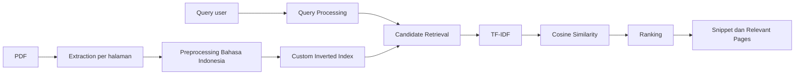

# Metode Information Retrieval Litera

Dokumen ini menjelaskan metode temu kembali informasi yang dipakai Litera untuk corpus PDF literatur ilmiah mahasiswa. Fokus MVP adalah pipeline klasik yang dapat dipresentasikan: ekstraksi teks, preprocessing Bahasa Indonesia, inverted index custom, TF-IDF, cosine similarity, snippet, dan evaluasi Precision@K/Recall@K.

## 1. Tujuan Sistem Temu Kembali

Litera membantu mahasiswa menemukan literatur yang relevan dari struktur:

```text
Bidang Penelitian -> Koleksi Penelitian Mahasiswa -> PDF Literatur Ilmiah
```

Search dapat dilakukan secara global, dibatasi bidang penelitian, atau dibatasi satu koleksi.

## 2. Corpus PDF

Corpus adalah kumpulan PDF yang diunggah ke koleksi penelitian. Metadata dokumen disimpan di tabel `documents`, sedangkan file PDF tersimpan lokal di `backend/uploads/`.

PDF aktual untuk demo tidak disimpan di Git. Dataset lokal dikelola melalui `demo-data/manifest.json`.

## 3. Ekstraksi Teks per Halaman

Backend memakai PyMuPDF untuk membaca text layer PDF per halaman. Hasil ekstraksi disimpan ke `document_pages`:

- `raw_text`: teks asli halaman untuk snippet.
- `clean_text`: teks hasil preprocessing untuk indeks.
- `page_number`: nomor halaman 1-based untuk UI.

PDF scan tanpa text layer diberi status `failed`; OCR belum termasuk scope MVP.

## 4. Preprocessing

Pipeline preprocessing dokumen dan query dibuat sama:

```text
Unicode normalization -> case folding -> tokenizing -> stopword removal -> stemming -> technical whitelist
```

Rinciannya:

- Case folding: semua teks dibuat lowercase.
- Unicode normalization: teks dinormalisasi agar variasi karakter lebih stabil.
- Tokenizing: teks dipecah menjadi token kata.
- Stopword removal: kata umum Bahasa Indonesia dihapus.
- Stemming: kata Bahasa Indonesia distem dengan Sastrawi.
- Technical whitelist: istilah teknis seperti `snmp`, `olt`, `onu`, `pppoe`, `ftth`, `mikrotik`, `qos`, dan `nms` dipertahankan agar tidak rusak oleh stemming.

## 5. Inverted Index

Litera tidak memakai Elasticsearch, vector database, embedding, semantic search, atau library search engine siap pakai. Index dibuat sendiri di SQLite.

Konsep:

```json
{
  "snmp": {
    "document_frequency": 3,
    "documents": {
      "17": {
        "pages": {
          "2": 4,
          "4": 9
        }
      }
    }
  }
}
```

## 6. Index Terms

Setiap term unik hasil preprocessing disimpan di `index_terms`.

Kolom penting:

- `term`: token hasil preprocessing.
- `document_frequency`: jumlah dokumen indexed yang mengandung term.

## 7. Postings

Kemunculan term disimpan di `index_postings`.

Kolom penting:

- `term_id`
- `document_id`
- `page_number`
- `term_frequency`

Satu baris posting menyatakan frekuensi sebuah term pada satu halaman dokumen.

## 8. Term Frequency

Term frequency menyatakan jumlah kemunculan term pada dokumen atau halaman.

Untuk ranking dokumen, frekuensi halaman dijumlahkan menjadi frekuensi term pada dokumen.

## 9. Document Frequency

Document frequency adalah jumlah dokumen yang mengandung suatu term. Litera menyimpan statistik global di `index_terms.document_frequency`, tetapi ranking search memakai scoped DF sesuai filter dan hak akses user.

## 10. TF-IDF

Litera memakai log-normalized TF dan smoothed IDF:

```text
tf_weight(tf) = 0 jika tf = 0
tf_weight(tf) = 1 + ln(tf) jika tf > 0

idf(term) = ln((N + 1) / (df(term) + 1)) + 1

weight(term, document) = tf_weight(term_frequency) * idf(term)
```

Keterangan:

- `N`: jumlah dokumen indexed dalam scope pencarian.
- `df(term)`: jumlah dokumen dalam scope yang mengandung term.

## 11. Cosine Similarity

Query dan dokumen direpresentasikan sebagai vector TF-IDF. Skor relevansi dihitung dengan cosine similarity:

```text
cosine_similarity(query, document) =
dot(query_vector, document_vector) / (norm(query_vector) * norm(document_vector))
```

Hasil diurutkan berdasarkan skor tertinggi saat `sort_by=relevance`.

## 12. Relevant Page Scoring

Setelah dokumen kandidat diranking, halaman relevan dihitung dari kontribusi term query pada posting halaman. Litera mengembalikan maksimal 5 halaman relevan dan `best_page` untuk membantu user membuka PDF pada halaman yang tepat.

## 13. Snippet Generation

Snippet dibuat dari `document_pages.raw_text`, bukan HTML. Backend mengirim plain text dan daftar `matched_terms`; frontend melakukan highlight aman dengan React text nodes tanpa `dangerouslySetInnerHTML`.

## 14. Query Preprocessing

Query diproses dengan pipeline yang sama seperti dokumen. Contoh:

```text
Input: "Monitoring jaringan OLT menggunakan SNMP"
Processed: monitoring, jaring, olt, snmp
```

Jika query terlalu pendek atau semua term hilang setelah preprocessing, backend menolak dengan pesan aman.

## 15. Filter Bidang dan Koleksi

Search mendukung:

- Global: seluruh dokumen indexed yang dapat diakses user.
- Per bidang: `research_field_id`.
- Per koleksi: `research_project_id`.
- Per owner: `owner_id`, terutama untuk admin atau use case lanjutan.

Candidate retrieval tetap berasal dari inverted index, lalu disaring berdasarkan scope.

## 16. Privacy Public/Private

Aturan akses:

- Mahasiswa dapat melihat dokumen public dan dokumen miliknya sendiri.
- Dokumen private user lain tidak muncul di search, tidak masuk result count, dan tidak bocor lewat snippet.
- Admin dapat mencari seluruh dokumen.
- Endpoint file PDF tetap memeriksa owner/admin/visibility.

## 17. Keterbatasan MVP

- OCR belum didukung untuk PDF scan.
- Semantic search, embedding, vector database, dan Elasticsearch tidak digunakan.
- Corpus MVP masih kecil sehingga evaluasi awal bersifat demonstratif.
- Ranking belum memakai field boosting metadata seperti judul atau keyword.
- Evaluasi relevansi bergantung pada judgment manual.

## 18. Contoh Query

- `snmp olt onu`
- `mikrotik api pppoe`
- `analisis gangguan ftth`
- `quality of service bandwidth`
- `monitoring jaringan`

## 19. Contoh Postings

```text
term: snmp
document_frequency: 2

postings:
- document_id=4, page_number=1, term_frequency=3
- document_id=4, page_number=5, term_frequency=1
- document_id=7, page_number=2, term_frequency=2
```

## 20. Contoh Hasil Ranking

```text
Query: snmp olt onu

1. monitoring-olt.pdf
   score: 0.82
   relevant_pages: 1, 3, 5

2. analisis-onu-ftth.pdf
   score: 0.61
   relevant_pages: 2, 4
```

## 21. Precision@K dan Recall@K

```text
Precision@K =
jumlah dokumen relevan pada K hasil teratas / K

Recall@K =
jumlah dokumen relevan pada K hasil teratas / jumlah seluruh dokumen relevan
```

Jika ground truth kosong, Recall@K ditampilkan sebagai `-`.

## 22. Cara Menjalankan Evaluasi

Siapkan dataset lokal:

```powershell
Copy-Item demo-data/manifest.example.json demo-data/manifest.json
Copy-Item demo-data/relevance-judgments.example.json demo-data/relevance-judgments.json
```

Letakkan PDF di `demo-data/pdfs/`, lalu import:

```powershell
cd backend
.\.venv\Scripts\Activate.ps1
python -m app.cli.import_demo_dataset --manifest ../demo-data/manifest.json
```

Jalankan evaluasi:

```powershell
python -m app.cli.evaluate_ir --judgments ../demo-data/relevance-judgments.json --k 5
```

## Diagram Pipeline


